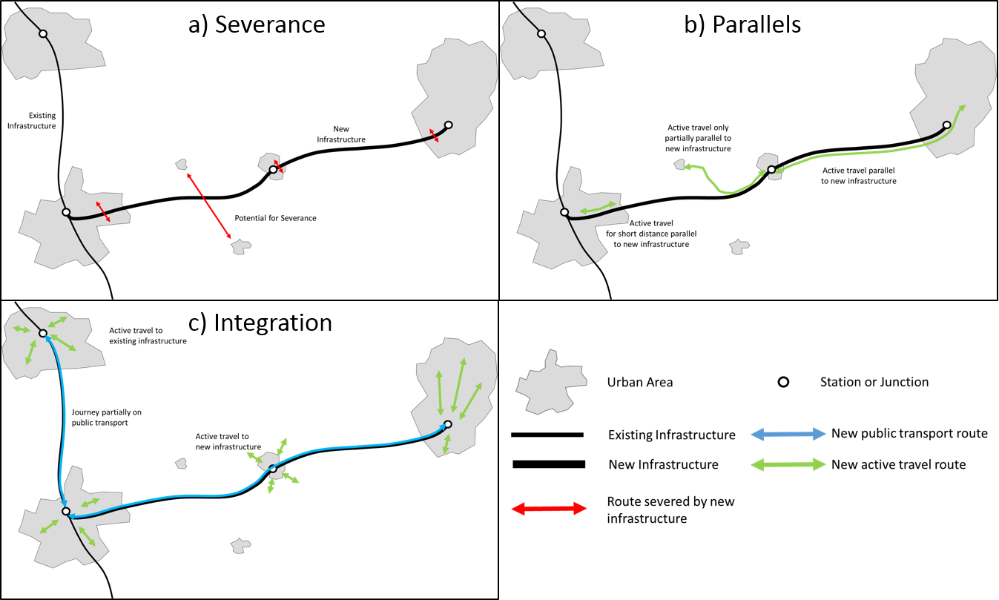
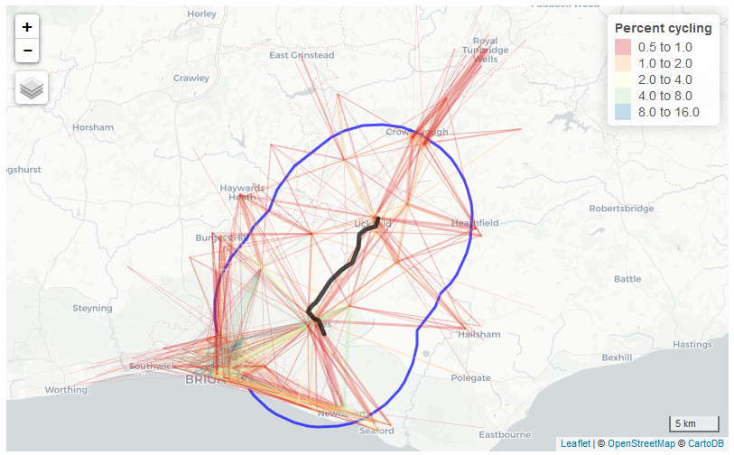
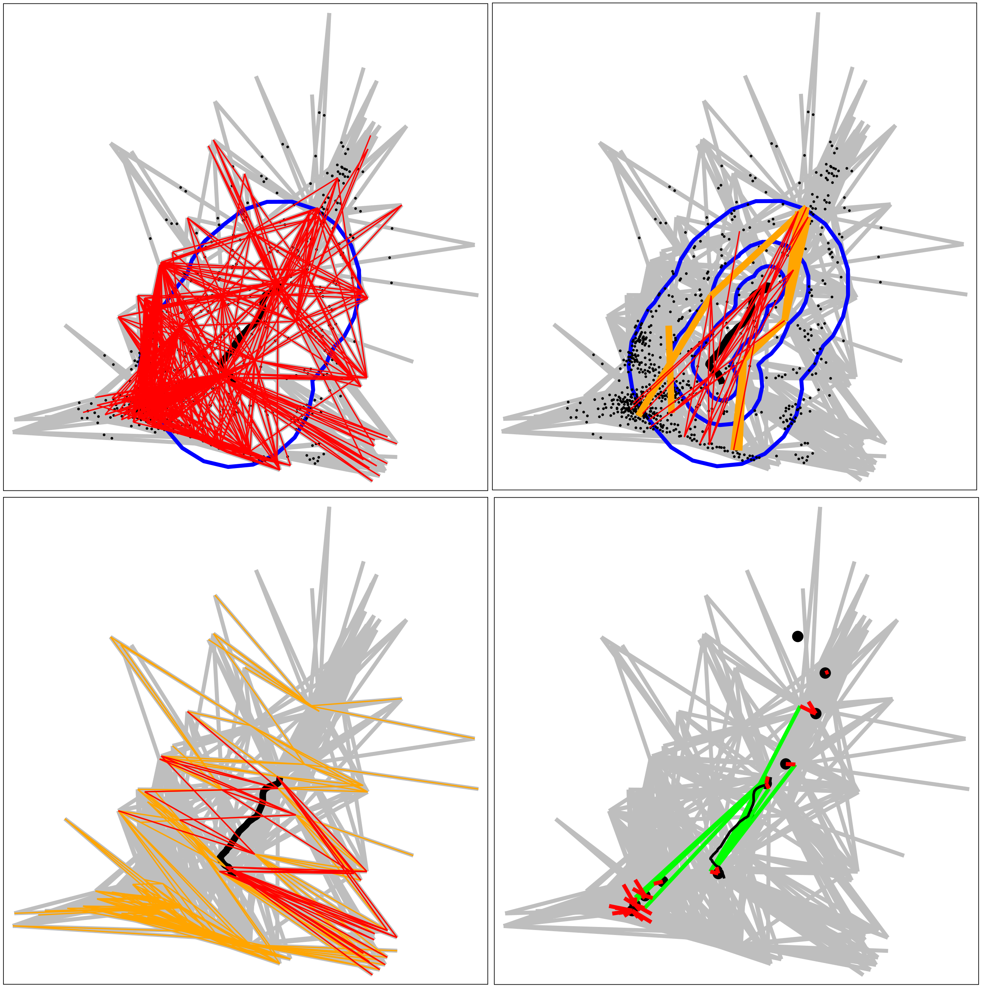
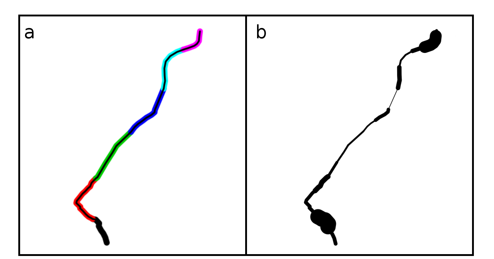
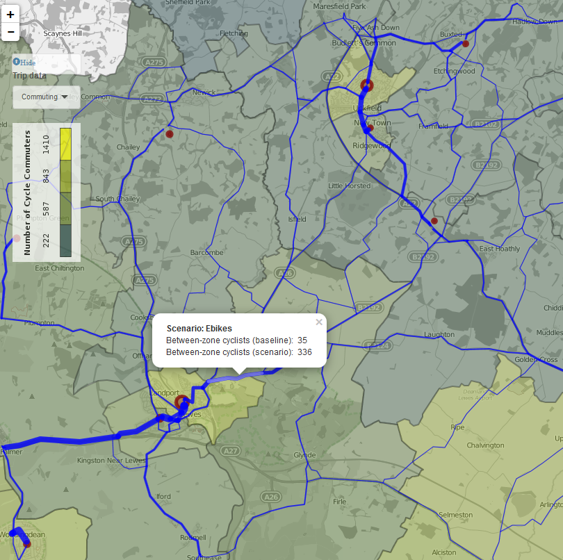
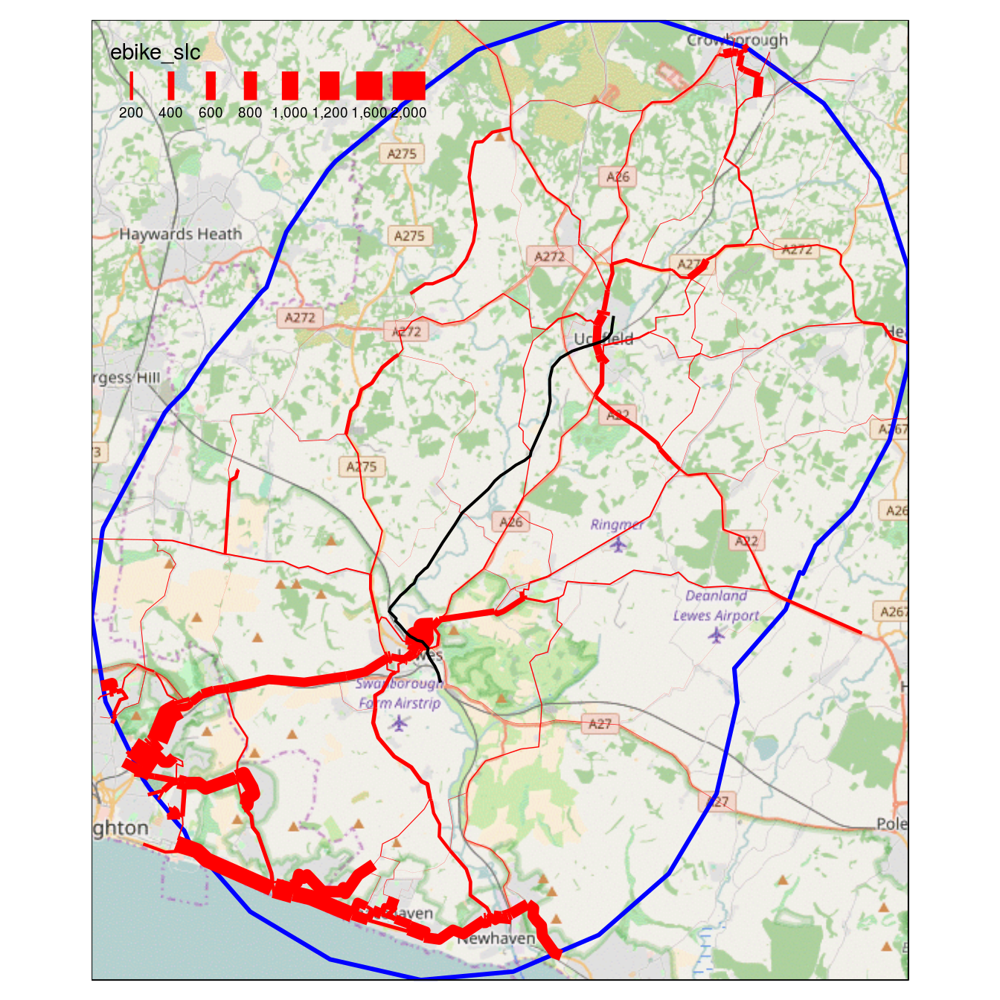
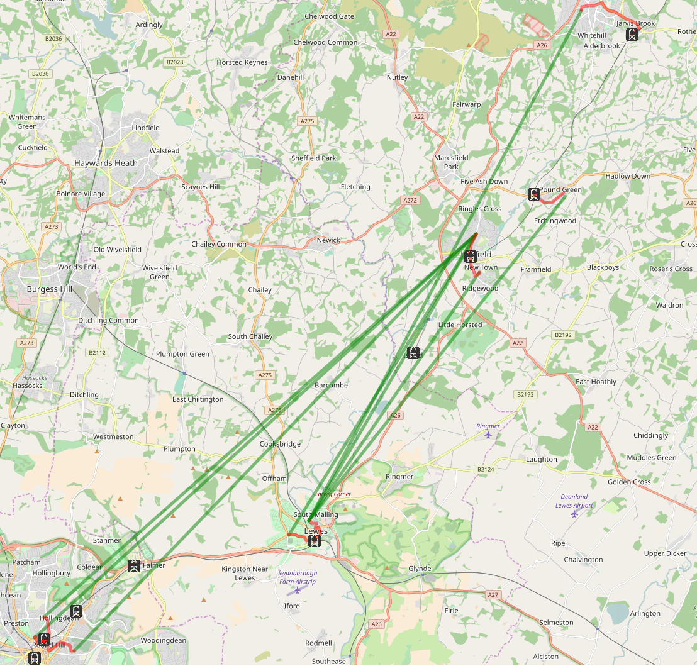

```{r, echo=FALSE, eval=FALSE}
# Set-up code:
# compare
browseURL("README.docx")
# In libreoffice go to edit -> changes -> compare and compare with the google version
library(rbbt)
# bbt_write_bib(path = "vignettes/references.bib", bbt_detect_citations(path = "vignettes/paper.Rmd"), overwrite = TRUE)
bbt_update_bib <- function(path_bib, path_rmd) {
  bbt_write_bib(
    path = path_bib,
    keys = bbt_detect_citations(path_rmd),
    overwrite = TRUE)
}
bbt_update_bib("references.bib", "README.Rmd")
```

<!-- Warning: modify the .Rmd file not the .md file -->

```{r setup, include=FALSE}
knitr::opts_chunk$set(echo = FALSE, warning = F, message = FALSE, fig.align = "center", fig.height = 4, options(scipen=999), out.width = "80%")
pkgs = c("mapview", "tmap", "sf", "stplanr", "tidyverse")
pkgs_installed = pkgs %in% installed.packages()
pkgs_to_install = pkgs[!pkgs_installed]
if(any(!pkgs_installed)) install.packages(pkgs)
purrr::map_lgl(pkgs, require, character.only = TRUE)
# knitr::opts_chunk$set(eval = FALSE)
```

<!-- Plan: submit this to the International Journal of Sustainable Transportation by end of May 2021 -->

# Abstract {-}

Major transport infrastructure projects affect many aspects of life.
This is well known and sometimes acted on, thanks in part to well-established methods in economic appraisal, cost-benefit analysis and environmental impact assessment.
More recently, other types of assessment have emerged, including health and equality impact assessment.
<!-- [@harris-roxas_differing_2011]. -->
There is emerging literature focussing explicitly on active travel impacts, much of which seeks to evaluate the impacts of new schemes on walking.
<!-- [@mueller_health_2015]. -->
However, there is little research in the literature on methods for assessing likely impacts of new schemes before they are built (a priori), let alone geographic methods for assessing potential impacts based on potential levels of walking and cycling.
Motivated by the need for accessible and scalable tools to assess active travel impacts of new developments, this paper sets out methods for active travel impact assessment.
It is based on the following classification of active travel impacts: *severance*, when new infrastructure cuts across routes with high active travel potential; *parallels*, opportunities for constructing active travel features parallel to new infrastructure; *integration* with existing transport services, where new or different active travel options are unlocked by new infrastructure; and impacts that arise during the *construction* phase of major infrastructure projects.
The methods allow enable actionable evidence on the first three types of impact to be generated from two inputs that are widely available: origin-destination data representing travel in the local area from surveys or simulations, and the centreline of the proposed new linear infrastructure.
The methods have relatively low time and cost requirements, enabling their use throughout the planning process.
We envision the approach being used to assess scheme sustainability, rank route options, inform safe walking and cycling routes to public transport nodes on the new infrastructure and prioritise crossing points options during project scoping, planning, construction and post-build stages.
A case study of a proposed railway between Lewes and Uckfield in Essex, UK, demonstrates the methods' real-world application and potential to be used to assess larger infrastructure projects such as high speed rail projects.

<!-- Cycling and Society abstract -->

<!-- background, methodology, results and impact of the research -->

<!-- Motivated by the need for accessible and scalable tools to assess active travel impacts of new developments, this paper sets out methods for active travel impact assessment. It is based on the division of active travel impacts based on the geographic relations between the development and walking and cycling desire lines: Severance, when new infrastructure cuts across routes with high active travel potential; parallels, opportunities for constructing new routes parallel new infrastructure; and integration with existing transport services, where new or different active travel options are unlocked by new infrastructure. A case study of a proposed railway, between Lewes and Uckfield in Essex, UK, demonstrates the methods’ real world application. -->

<!-- We find that the methods have the potential to identify and act on risks and opportunities associated with proposed developments down to road segment level. -->

<!-- We conclude that new methods, such as those presented in this paper, have the potential to ensure that the impacts of major infrastructure projects on walking and cycling are properly accounted for before building begins. -->

# Introduction

As authorities plan for recovery in the aftermath of the global coronavirus pandemic, expansion of transport infrastructure is seen as a way to provide an economic boost through new jobs and investment.
Such projects may range from the localised widening of a rural road to the construction of a new high-speed railway.
Prior to the pandemic, an additional 3-5 million kilometres of roads were planned to be constructed by the middle of the century [@meijer_global_2018].
Nearly 12,000 kilometres of high-speed rail were under construction in 2020, representing a 25% increase in total high speed route length.

Meanwhile, the pressure on authorities to consider how such projects impact sustainability objectives continues to grow.
In much of the developed world, transport is now the largest sector of the economy by greenhouse gas emissions.
As new emission reduction targets are set on regional, national and international levels, the types of infrastructure being prioritised will change as the need to shift towards more sustainable modes of moving people and goods across land becomes more urgent and widely understood.

Whilst the need for modal shift is increasingly well understood, the impacts that any new infrastructure might have on already established sustainable modes of travel such as walking and cycling --- also referred to as active travel --- is not.
Despite impact assessment being standard practice in development projects worldwide, its use to explore the ways in which new linear infrastructure can impact on or indeed benefit active travel is limited.

# Research and policy landscape

## The big picture

Major transport infrastructure projects are a beneficiary of large-scale investment of public funding worldwide.
Justifications include economic growth [@preston_economics_2013], reduction of geographical inequalities [@liu_spatial_2016], modal shift (i.e., a switch from private car or flying to rail) [@dobruszkes_highspeed_2011], and improved quality of life due to reduced time spent travelling [@fischerjamiemontague_quality_2011].In practice, psychological and political factors (which tend to overestimate benefits) are often the deciding factors [@flyvbjerg_policy_2005; @cantarelli_characteristics_2012].
In this context, there have been calls to make the decision-making process more evidence-based [@hodge_publicprivate_2010], to account for environmental [e.g.
@akerman_role_2011] and health [e.g.
@mueller_health_2015] externalities.
Improving the assessment of the latter impact is the focus of this paper.

<!-- Regardless of the diverse motivations for transport infrastructure investment, it is clear that they have and will continue to have major impacts.  -->

<!-- There is a substantial body of literature dedicated to the evaluation of the impacts of transport infrastructure, which can be considered a sub-discipline in the field of transport studies in its own right. -->

<!-- Despite the wide range of impacts incorporated in impact assessments, and the widening of assessments to incorporate social impacts [@jones_social_2012], active travel considerations are seldom considered, let alone analysed quantitatively. -->

## The use of impact assessments

Impact Assessment (IA) is an established part of the decision-making process and an active field of research which already provides a framework within which active transport impacts can be accounted for.
A potential problem is that these impacts could be included in an increasingly wide range of IA frameworks, including Environmental Impact Assessment (EIA), Strategic Environmental Assessment (SEA), Health Impact Assessment (HIA), Gender Impact Assessment (GIA) and Equality Impact Assessment (EqIA) [@tajima_should_2013].
Within this gamut of activity, the methods in this paper clearly relate most closely to HIA, although in practice, active transport could be included in any one of those IAs.
EIA, for example, often includes a substantial health component, and health is enshrined in the European Union Directive 2014/52/EU on impact assessment [@\_directive_2014].

Noting the increased prevalence of HIA in the overall IA process, @harris-roxas_differing_2011 provide an overview of this emerging field and propose a typology: mandated, decision-support, advocacy, and community-initiated HIAs.
Noting this diversity, the methods designed in this paper are designed to be accessible for practitioners (and advocates) working on each type of HIA at zero cost --- the underlying code is open source [@lovelace_stplanr_2018].
@harris-roxas_differing_2011 (and much work by HIA practitioners) cover a range of impacts but make no explicit mention of impacts on walking and cycling, despite the inevitable impacts of major projects on them and well-known benefits of these active travel modes.
These include:

-   Increased life expectancy and physical well-being as a result of regular physical activity, estimated to have a major reduction of disability-adjusted life years lost due to non-communicable disease such as heart attacks [e.g. @gotschi_contrasts_2015].
-   Reduced energy use and associated improvements in environmental outcomes through a modal shift away from the motor car [@lovelace_assessing_2011].
-   Improved air quality through reduced dependence on motor vehicles accessing urban centres [@xia_trafficrelated_2015].
-   Improvements in transport equality, as people able to use pedal cycles (and electric and hand-cycles) but excluded from personal car use (e.g. by age, income or disability) become equally able to travel along active travel pathways as car drivers [@mullen_knowing_2014].

<!-- Economic, health and environmental impacts are the focus (each of which link to active travel, as discussed in the subsequent paragraphs). In parallel to such research programs, there has been growing interest from transport researchers in the impacts of major infrastructure projects on transport patterns overall (going beyond the question of utilisation of the transport service provided by the specific piece of new infrastructure). -->

<!-- *Economic impact assessment* ... -->

<!-- *Environmental impact assessment* ... -->

Of existing impact assessment approaches, Health Impact Assessment (HIA) and Transport/Traffic/Transportation Impact Assessment (TIA) have the most obvious links to active travel.
Even when these additional assessment exercises are undertaken, or when they are amalgamated with the wider process of Strategic Environmental Assessment (SEA) [@tajima_should_2013], active travel impacts are rarely considered, let alone quantified.
This has been noted in the context of road building schemes: "there is very little empirical data on the [health] impact of road transport interventions" aside from injury reduction estimates [@thomson_assessing_2008].
<!--  I can't see where TIA is defined, plus SEA is already defined -->
Since then, there has been an increase in the research attention focussed on the wider impacts of road construction.
A notable research project in this area is [Traffic and Health in Glasgow](http://www.cedar.iph.cam.ac.uk/research/directory/traffic-health-glasgow/) which analysed the impacts of an extension to the M74 motorway in 2011.
This project has resulted in numerous findings, including evidence of reduced levels of physical activity among participants who lived in close proximity to the motorway [@prins_effects_2017].
Notably, the project found evidence of increased car use in areas affected by the new road, although no evidence of active travel impacts was identified [@foley_effects_2017].

When active travel considerations are taken into account, it is often done so under subheadings of health, air pollution, and other impacts, rather than as a self-standing category of impact in its own right.
@cohen_health_2014 are unusual in mentioning active travel impacts of new transport infrastructure projects, but they do so under the sub-categories of physical health, mental health, transport inequalities and road safety.
Active travel is mentioned in the heading, but only as a sub-sub-heading within road safety: "Active travel and (mis)perceptions of danger".
@joffe_framework_2002 provide a more representative example of the HIA literature: it has no mention of walking, cycling or active travel.

## Taking account of active travel

There is a clear need for methods and concepts to encourage active travel impacts to be considered in the assessment of major infrastructure projects.
At the risk of further diluting the impact assessment literature with more acronyms [see @tajima_should_2013] we refer to this aspect of impact assessment as Active Travel Impact Assessment (ATIA), as a component of the wider process of HIA.
Because active travel is central to health, environmental and social impacts, we suggest that ATIA
<!-- (or some alternative to it, perhaps building on the methods outlined in this paper or integrated into wider IA processes) --> 
is a vital component of health impacts.
Despite the importance of active travel modes, there are few tools for a priori (pre build) assessment and quantification of the impacts of large infrastructure projects on walking and cycling.

One tool that has been developed specifically to explore active transport potential at regional to street levels (the geographic scope of many large transport infrastructure projects) is the Propensity to Cycle Tool (PCT) [@lovelace_propensity_2017].
The PCT is a publicly accessible tool for exploring current cycling levels and future potential under a range of national scenarios (see [www.pct.bike](http://www.pct.bike/)).
This prior work, and the fact that the PCT is open source, suggests the underlying methods --- geographic analysis of travel desire lines, routes and route networks --- could also be used for ATIA, but using local rather than global scenarios of change.


<!-- ## Why is active travel omitted from IA? - commented out for now as not directly relevant -->

<!-- Active transport lies at the opposite end of the spectrum of transport investment. Interventions that increase 'walkability' and 'cyclability' are usually (but not always or necessarily) smaller, cheaper and less disruptive than major infrastructure. They are often localised. They are often the responsibility of local transport authorities, whereas major infrastructure projects are almost always overseen by national transport departments or dedicated organisations reporting directly to central government. -->

<!-- This helps explain why the active travel impacts of major transport infrastructure projects are seldom considered, despite several obvious overlaps. -->

<!-- Whis i sithis in quotes it not clear who is being quoted it is Ogilvie?-->

"Major transport projects may promote or discourage physical activity in the form of walking and cycling", yet there has been little quantitative a posteriori (post build) evaluation of past projects [@ogilvie_evaluating_2006], let alone a priori assessment of potential impacts.
The present paper seeks to address this research and methodological gap via geographical methods and emphasis on cycling potential.

The lack of organisational overlap between major transport infrastructure and active travel interventions helps explain why the two are seldom considered.
Yet, as we shall see in the next section, major transport infrastructure has the potential to have a wide range of impacts on transport behaviour overall and levels of active travel in particular.
The purpose of this paper is to create a framework for the consideration of active travel impacts of major transport infrastructure.
More importantly, from a practitioner perspective, it outlines and demonstrates methods for assessing these impacts and prioritising interventions that will reduce the negative impacts on walking and cycling.
<!-- The most radical option to minimise the active transport impacts of building large roads and railways is not to build them at all and invest in a series of smaller walking and cycling interventions instead. Arguments for doing this are discussed in the final section. -->

# A typology of active transport impacts of major transport infrastructure projects

Major infrastructure can impact upon active transport in a range of different ways.
To organise the assessment process, these can be categorised into three broad types of post build impact, as illustrated in Figure \@ref(fig:type).
There may also be substantial impacts during the construction phase, as outlined in Section \@ref(impacts-during-construction).
The focus of this paper is on impacts after the infrastructure project has been completed; impacts during the construction phase of major infrastructure projects merit further research (the Sheffield tram project took four years, from 1991 to 1995, with impacts on walkways and roads during the construction stage affecting active travel, to provide one example).

<!-- [Note from Robin: it would be good to bulk each of these sections up with references and more description.] -->

```{r type, echo=FALSE, fig.cap="A typology of active travel options.", out.width="100%"}

```

<!-- *Lable indervidual diagrams ... -->

## Severance

Linear infrastructure can become a barrier to travel perpendicular to the new infrastructure, severing routes that were used before the new infrastructure was built.
This is especially true for railways and motorways, which may be at a different level to the surrounding road network and are not crossable by walkers and cyclists without dedicated crossings.
Understanding where severance occurs and how many people are affected can aid in effectively planning the construction of bridges, tunnels, and other crossings.

## Parallels

New linear infrastructure provides an opportunity to construct new foot and cycle paths alongside the infrastructure.
The marginal cost of adding active transport routes alongside other planned infrastructure will often be lower than constructing a dedicated route from scratch.
Such new parallel footways and cycleways could encourage people to entirely replace existing trips with non-active modes.
Furthermore, parallels can encourage people to walk or cycle to the nearest junction/station, boosting the potential for integration (covered in the next section).
The consideration of parallels encourages HIAs to explore not only the project's potential to affect current active transport trips but also the potential to generate new ones.

## Integration of active travel and public transport

New infrastructure can result in an increase in active travel in nearby areas along the route.
For example, a railway extension may result in more people walking or cycling in the centre of town to access the rail network whereas they previously drove directly to their destination.
This effect can manifest at a substantial distance from the new infrastructure by linking previously disconnected areas.

## Impacts during construction

Whilst the finished state of a project will have long lasting implications for active travel (and other aspects of sustainability not covered here), the impact during construction can have a larger, albeit temporary, impact.
Construction projects of any size result in localised increases in traffic from the movement of workers and materials.
Existing roads are often closed temporarily to allow for construction activity to occur, which can cause travelers to have to detour and certain trips to no longer be feasible.
Where existing roads do not provide suitable access, temporary roads are constructed, which can mean that the impacts described in the preceding sections are magnified.
These impacts are harder to model than the others because they are highly dependent on the construction processes and practices in place.

However, it is worth considering construction phase impacts to inform countermeasures.
Heavy trucks could be allowed to travel through residential areas or along active travel routes during certain times where there are low levels of walking and cycling, reducing impacts, for example

# Methodology

A method for assessing each of the three types of active travel impact is outlined in this section, such that it could be applied to any linear feature of interest.
Once set out, the method is then applied to a specific example using a case study of the Lewes-Uckfield train line.
The methods have been implemented as functions in the R package **stplanr** [@lovelace_stplanr_2018].
<!-- I'd recommend that we keep a consistent order: severance - parallels - integration -->

## Potential for severance

Severance occurs when movement along routes with high active travel potential is prevented or made more difficult by obstacles such as rivers, fast roads or railway tracks.
A degree of severance can be expected along the full of linear infrastructures.
However, the degree of severance will be greatest in certain *severance pinch points* (henceforth referred to as severance points), for example, segments along a rail track which intersects desire lines connecting residential areas with employment zones on the other side.

The methodology used to identify proposed route segments with high potential to cause severance (assuming the transport infrastructure is new) consists of three stages:

-   Identify the desire lines which intersect with the infrastructure.
-   Quantify the number of potential cyclists blocked along segments of the infrastructure.
-   Subset the segments which block the highest number of potential cyclists and identify potential crossing points.

Note that based on the three-stage methodology outlined above, severance points are, in fact, more precisely described as 'severance segments' along which a range of points could be chosen for crossing points. However, the term 'severance point' is more intuitive, so we use this term throughout.

## Potential cycling uptake along 'parallels'

To identify parallels to linear features (i.e., a new road or rail line), a five-stage methodology was developed.

<!-- This is not the first time you have used desire line, so why define it here?-->
-   Subset cycling desire lines^[ A 'desire line' refers to a straight line connecting an origin-destination pair. In the context of this paper, which uses the outputs of the PCT version 1 as its input dataset, this means straight lines with a distance of 20 km or less connecting Middle Super Output Area population-weighted centroids, with data on the number of people commuting in both directions. See @lovelace_propensity_2017 for further details.] to include only those in which the *centre point of the line* passes close to the new infrastructure. This was set as a 10 km buffer in this paper.
-   Break the linear infrastructure of interest into segments of even distance.
-   Calculate the angle of the segments and desire lines.
-   Subset the desire lines again, to include only those that are within a threshold angle (set at 30 degrees) of the mean bearing of their closest infrastructure segment.
-   Aggregate the cycling potential of all parallel lines within the threshold distance of each segment and assign the values to the route segments, based on methods set out in [@lovelace_propensity_2017]. <!-- it might be worwthile to breifly define what is meant by a subset - some readers may not be aware of this technique -->

## Potential for cycling and public transport integration

Increased travel to public transport is likely to occur near public transport stops and on desire lines that have an origin and destination near connected public transport nodes (typically bus stops or train stations).
The methodology used to estimate the potential uptake of cycling due to integration with new public transport services associated assumes that new nodes have suitable provision for cycling, including safe cycling routes to the stations/stops and cycle parking and consists of the following stages:

-   Subset trips that could feasibly use public transport in terms of boarding and alighting, by subsetting those with both origin and destination within a given distance of a planned station/stop. <!-- what distacne was used? Perhaps also exclude minimum distance (no point cycling 50 metres?-->
-   Remove lines that have the same stop as their closest origin and destination.
-   Remove lines which are linked by existing public transport, thus will not change with the new linear infrastructure.
-   Create new desire lines and routes that are from Origin/Destinations to public transport.
-   Remove desire lines and routes where the cycling to and from public transport is greater than 1.1 times the direct cycling route, as these travellers are unlikely to use public transport. <!-- why 1.1? -->
-   Calculate change in cycling potential along these new desire lines.

This method makes several simplifying assumptions that may or may not be valid depending on the nature of the new linear infrastructure.
Firstly, the method is ignorant of the public transport network and so assumes that travel between any pair of stops is possible and practical.
If this were not the case, it would be necessary to break the analysis into connected parts and analyse each part of the networks separately.
Secondly, the method is not aware of financial and time costs associated with public transport.
While the method can identify routes that are likely to be quicker to take a combined active travel and public transport journey than merely active travel directly, it does not consider the relative difference with driving directly.
Therefore, care should be taken when assigning cyclist to these new routes.
Finally, the method does not consider the proportion of walking and cycling to and from the public transport stop.
This is likely to be affected by a range of variables such as distance and the ability to take a bike on public transport.

<!-- this is a long list of caveats, do we need more to strengthen this part of the paper? -->

# A case study of Lewes-Uckfield

The Lewes-Uckfield train line is a proposed project to restore a rail link between Uckfield and Lewes on the south coast of England.
This is part of wider plans to increase rail capacity in the area.
As stated in the project brief, "Such infrastructure has the potential to support cycling if high-quality infrastructure is built alongside." This appendix analyses cycling potential along the proposed route, which is 16 km in length (see Figure \@ref(fig:lc)).
<!-- we'll need to provide more information on the case study - where exactly is it in terms of UK geography, length of new route, is it a terminal station etc. --> Data on existing and potential future active travel patterns was taken from the Propensity to Cycle Tool [@lovelace_propensity_2017].
The data represents commuter travel between zones created for the 2011 census.
These zones are known as Middle layer Super Output Areas (MSOA), and the population-weighted centroids of each MSOA are used as the origin and destinations in this analysis.

<!-- # Cycling potential surrounding the Lewes-Uckfield trainline -->

```{r, echo=FALSE, warning=FALSE}
# Basic stats on Lewes-Uckfield route ----
# lewes_uckfield = readRDS("../pct-team/input-data/lewes_uckfield.Rds")
# lewes_uckfield_sf = sf::st_as_sf(lewes_uckfield)
# write_sf(lewes_uckfield_sf, "../pct-team/input-data/lewes_uckfield.geojson")

# access data data ----
f = "lewes_uckfield_objects.Rdata"
if(file.exists(f)) {
  load(f)
  lewes_uckfield = read_sf("https://github.com/npct/pct-team/raw/master/input-data/lewes_uckfield.geojson")
} else {
  lewes_uckfield = read_sf("https://github.com/npct/pct-team/raw/master/input-data/lewes_uckfield.geojson")
  z = read_sf("https://github.com/npct/pct-outputs-regional-notR/raw/master/commute/msoa/east-sussex/z.geojson")
  l = read_sf("https://github.com/npct/pct-outputs-regional-notR/raw/master/commute/msoa/east-sussex/l.geojson")
  cents = read_sf("https://github.com/npct/pct-outputs-regional-notR/raw/master/commute/msoa/east-sussex/c.geojson")
  lewes_uckfield_osgb = st_transform(lewes_uckfield, 27700)
  # st_length(lewes_uckfield_osgb) # 16 km
  l$`Percent cycling` = l$bicycle / l$all * 100
  # names(cents)
  # Generate and save objects specific to the project (to save loading large datasets)
  buff = geo_buffer(lewes_uckfield, dist = 10000)
  plot(buff$geometry)
  cents_lc = cents[buff,]
  z_lc = z[cents_lc,]
  l_lc = l[buff,]
  save(buff, cents_lc, z_lc, l_lc, file = "lewes_uckfield_objects.Rdata")
  # plot(cents_lc)
  # sum(cents_lc$all)
}
```

<!-- missing numbers -->

There are `r # nrow(cents_lc)` MSOAs whose population-weighted centroids lie within a 10 km buffer of the train line, representing `r # sum(cents_lc$all)` commuters.
This area is illustrated in Figure \@ref(fig:lc).

```{r lc, fig.cap="Overview of the Lewes-Uckfield line with a 10 km buffer (blue). Width is proportional to the number of commutes; colour represents the proportion of people who cycle.", out.width="70%"}
# tmap_mode("view")
# b = tmaptools::bb(l_lc, 1.8)
# tm_shape(buff, bbox = b) + tm_borders(col = "blue", lwd = 3) +
#   tm_shape(l_lc) +
#   tm_lines(lwd = "all", scale = 20, col = "Percent cycling", alpha = 0.4, breaks = 2^(-1:4),
#                               palette = "Spectral", auto.palette.mapping = F) +
#   tm_shape(lewes_uckfield) + tm_lines(lwd = 5, col = "black") +
#   tm_scale_bar()

```

The total number of single-stage commuters that pass through the buffer is higher: `r # sum(l_lc$all)` 56,536 commuters.
As Figure \@ref(fig:lc) illustrates, however, many of these commuters are not travelling parallel to the train line.
The majority of desire lines intersecting the buffer are between Brighton, the largest city in the region, and its surrounding settlements (see the high density of flows in the far south-west of Figure \@ref(fig:lc)).
Only a few hundred commuters pass directly parallel to the route, mostly of medium distance from 10 to 20 km (route distance) between MSOAs in Lewes, Ringmer, and Uckfield.
This implies that cycle paths running parallel to the train line itself have relatively low commuter cycling potential.

## Cycling potential parallel to the route

```{r gendata, echo=FALSE, message=FALSE}
# Old sp way to be deleted
# l_cp = as_Spatial(l_lc) %>% 
#   geo_projected(., fun = maptools::SpatialLinesMidPoints) %>% 
#   st_as_sf()
# centre point subsetting
l_cp = sf::st_point_on_surface(l_lc)

# sel_centrepoint = rgeos::gContains(buff, l_cp, byid = T)[,1]
sel_centrepoint = st_contains(buff, l_cp, sparse = FALSE)[1, ]


# Line bearing code
l_a = line_bearing(lewes_uckfield)
a = angle_diff(l = l_lc, angle = l_a, bidirectional = TRUE)
sel_para = a < 30

# Parallel subsetting
buff7 = geo_buffer(lewes_uckfield, dist = 5000)
buff_small = geo_buffer(lewes_uckfield, dist = 2000)
sel_centrepoint5 = st_contains(buff7, l_cp, sparse = FALSE)[1, ]
sel_smallbuff = st_intersects(l_lc, buff_small, sparse = FALSE)[, 1]
# sel_smallbuff = !is.na(over(l_lc, buff_small))
sel_finalpar = sel_para & sel_centrepoint5 & sel_smallbuff
l_lc$`Parallel selection` = sel_finalpar
l_lc$`Touching buffer` = TRUE

# Perpendicular lines
# l_seg = lewes_uckfield %>% as(., "Spatial") %>% 
#   line_segment(., segment_length = 1000) %>% 
#   st_as_sf(.)
# saveRDS(l_seg, "l_seg.Rds")
l_seg = readRDS("l_seg.Rds")

# saveRDS(l_seg, "l_seg.Rds")
# l_seg = readRDS("data-sources/l_seg.Rds")
l_lc$Perpendicular = a > 60
sel_intersects = st_intersects(l_lc, l_seg) 
# sum(sel_intersects[[1]])
sel_intersects = map_lgl(sel_intersects, ~sum(.) > 0)
l_lc$`Perpendicular selection` = sel_intersects & a > 60
l_agg = aggregate(l_lc["govtarget_slc"], l_seg, FUN = sum)
```

### Subsetting desire lines by centre point proximity

```{r centre points, fig.cap="Illustration of the 'line centre point' subsetting method.", eval=FALSE}
tmap_mode("plot")
tm_shape(l_lc) + tm_lines(col = "grey", lwd = 3) +
tm_shape(buff) + tm_borders(col = "blue", lwd = 3) +
  tm_shape(lewes_uckfield) + tm_lines(lwd = 5, col = "black") +
  tm_shape(l_cp) + tm_dots() +
  tm_shape(l_lc[sel_centrepoint,]) + tm_lines()
```

The centre points of the desire lines intersecting with the Lewes-Uckfield route buffer are presented in Figure \@ref(fig:metafigure)a.
These represent 57%
<!-- `r # round(sum(sel_centrepoint)/length(sel_centrepoint) * 100, 1)` -->
of the desire lines in the study area, defined by the 10 km buffer.

<!-- this figuure is unclear -->

```{r metafigure, echo=FALSE, fig.cap="The centre point-buffer (a), parallel (b), perpendicular (c) and station access (d) methods of subsetting desire lines affected by the new rail line. In all figures, the subsetted lines are plotted in red. In (b) the updated parallel desire lines, whose centre points lie within 5 km of the route, are illustrated in orange."}

```

### Dividing the infrastructure route into segments

The process of dividing the proposed route of the major infrastructure, in this case a railway between Lewes and Uckfield, is illustrated in Figure \@ref(fig:segs)a.
The method could be applied to larger and more complex routes, e.g., that of the proposed HS2 route in the UK or major planned roads in other countries.
Careful selection of segment lengths is needed to ensure the results are both sufficiently high resolution to act on but sufficiently aggregated to interpret and visualise.

<!-- 
```{r segments, fig.cap="Demonstration of the method for splitting the route into segments (a) ", out.height="7cm", eval=FALSE}
knitr::include_graphics("figures/lewes-uckfield-segments.png")
```
-->

```{r segs, fig.cap="Illustration of the method of splitting the route into discrete segments using the line segment function from the stplanr R package (a) and cycling potential severed by the proposed rail line (b), in which line width is proportional to the square root of cycling potential severed.", echo=FALSE}

```

### Calculating the bearing of route segments

The angle of the train track was calculated by a function `line_bearing()`, which was implemented in the **stplanr** R package specifically to solve this problem.
Using this function, the angle of the route segments can be calculated as follows:

```{r, echo=TRUE}
line_bearing(lewes_uckfield)
```

### Subsetting desire lines parallel with the train line

To find the lines that were close to parallel with the train line, the function `angle_diff()` was developed.
All lines within 30 degrees, clockwise or anti-clockwise, to the train line, *and* have their midpoint within the route buffer, are illustrated in the red lines in Figure \@ref(fig:metafigure)b.
It is clear from this Figure that many lines were selected that are very unlikely to benefit from cycling provision along the route, especially in the south-west segment of the plot.

<!-- these plots are unclear, I suggest not shoing the grey lines -->

```{r para, fig.cap="Illustration of the paralell lines subsettting method", eval=FALSE}
tm_shape(l_lc) + tm_lines(col = "grey", lwd = 3) +
tm_shape(buff) + tm_borders(col = "blue", lwd = 3) +
  tm_shape(lewes_uckfield) + tm_lines(lwd = 5, col = "black") +
  tm_shape(l_cp) + tm_dots() +
  tm_shape(l_lc[sel_para & sel_centrepoint, ]) + tm_lines()
```

<!-- this seems complex and confusing why not slelct line that start and end inside the 10 km buffer ? -->

To resolve this issue, a smaller buffer was used to select line centre points.
This was set at 5 km.
To remove desire lines that were still far from the train line a further subsetting method was developed.
This involved selecting desire lines that pass within an even shorter distance to the train line, 2 km in this case.
The results are presented in Figure \@ref(fig:metafigure)b, in which the orange lines were included through the centre point selection method but omitted by 'buffer intersection' method.

```{r paranew, fig.cap="Updated 'parallel' desire lines, whose centre-points lie within 5 km of the proposed route (orange) and passes within 2 km of the train line (red). The red lines represent the lines selected through this method.", eval=FALSE}
tm_shape(l_lc) + tm_lines(col = "grey", lwd = 3) +
tm_shape(buff) + tm_borders(col = "blue", lwd = 3) +
tm_shape(buff7) + tm_borders(col = "blue", lwd = 3) +
tm_shape(buff_small) + tm_borders(col = "blue", lwd = 3) +
  tm_shape(lewes_uckfield) + tm_lines(lwd = 5, col = "black") +
  tm_shape(l_cp) + tm_dots() +
  tm_shape(l_lc[sel_para & sel_centrepoint5 & !sel_smallbuff,]) + tm_lines(col = "orange", lwd = 5) +
  tm_shape(l_lc[sel_finalpar,]) + tm_lines()
```

From the subset of the lines highlighted in red in Figure \@ref(fig:metafigure)b, we can now report summary statistics on the cycling potential of commuter desire lines which run parallel to the Lewes-Uckfield route.
These results are presented alongside the equivalent statistics for *all* desire lines which intersect the 10 km buffer surrounding the proposed route.

## The potential for severance along the proposed route

### Subsetting 'perpendicular' desire lines

The subsetting process involved finding which lines ran perpendicular to the proposed rail line and then selecting only those intersecting with it, as illustrated in Figure \@ref(fig:metafigure)c.

```{r perpsel, fig.cap="'Perpendicular' desire lines intersecting with the proposed rail line. Orange lines are within 30 degrees from perpendicular to the proposed train line, red lines are both close to perpendicular to the line and intersect with the rail line.", eval=FALSE}
tm_shape(l_lc) + tm_lines(col = "grey", lwd = 3) +
  tm_shape(lewes_uckfield) + tm_lines(lwd = 5, col = "black") +
  tm_shape(l_lc[a > 60,]) + tm_lines(col = "orange") +
  tm_shape(l_lc[l_lc$`Perpendicular selection`,]) + tm_lines()
```

### Quantifying severance per segments of the train line

The cycling potential of the intersecting 'perpendicular' lines was then summed *per 1 km segment* of the rail line.
The results are presented in Figure \@ref(fig:segs)b, which shows, as one would expect, that severance impacts would be greatest at the ends of the proposed route, where population densities and employment opportunities are greatest.
<!-- what is the 'Government Target scenario'? - either define or remove -->

```{r perpagg, fig.cap="Total cycling potential 'severed' by the proposed rail line. Line width is proportional to the square root of the total cycling potential for each segment.", fig.height=5, eval=FALSE}
plot(l_agg, lwd = sqrt(l_agg$govtarget_slc) * 2)
```

### Identifying potential crossing points

<!-- why is this figure so far from the text? Perhpa merge the two figures on this topic-->

From Figure \@ref(fig:segs)b it is clear that the points of highest potential severance lie at either end of the line.
Overall, because the proposed line does not separate any large settlements or workplaces, the potential for severance is low.
However, to demonstrate the method of identifying places to intervene to minimise severance, Figure \@ref(fig:perpmost) illustrates the 1 km segment of the proposed line with the highest potential for severance in context.
This is clearly in a populated part of Lewes, where travel between both sides of the new line could be affected by the route.

```{r perpmost, fig.cap="The 1 km segment on the proposed rail line with the highest level of severance in cycling potential."}
l_most = l_agg[which.max(l_agg$govtarget_slc),]
# osm_tiles_most = tmaptools::read_osm(tmaptools::bb(l_most, 4), raster = TRUE)
# tm_shape(osm_tiles_most) + tm_raster() +
#   tm_shape(l_most) + tm_lines(lwd = 10) +
#   tm_shape(lewes_uckfield) + tm_lines(lwd = 2, col = "black") 
# m = mapview(l_most, lwd = 5, color = "red") +
#   mapview(lewes_uckfield, lwd = 1)
# mapshot(m, file = "/home/robin/npct/infra-active/figures/perpmost.png")
# library(magick)
# magick::image_read("figures/perpmost.png")
knitr::include_graphics("figures/perpmost.png")
```

## Cycling to Public Transport

<!-- inconsistant termonology with the typology establisshed above -->

Direct impacts of the proposed scheme on cycling potential would be those associated with desire lines in parallel with and crossing perpendicular to the railway.
Indirect impacts are those created by the potential to cycle to the stations [@flamm_public_2014] .
Because the proposed rail stations are located in areas of high population density, this could generate new cycle trips when they are taken as part of a multi-stage trip (e.g. cycle to the rail station, catch the train towards work, walk from the 'activity end' rail station to work).

<!-- why are we not using a 3km buffer? -->

Analysis of the origin-destination data in relation to proposed rail station locations suggests that relatively few desire lines, representing 2351 commuters, currently commute between areas served by the new rail stations, within a 3 km buffer (see \@ref(fig:metafigure)d).
The main beneficiaries in the local area would be people north of Uckfield commuting to Lewes and vice versa.
Desire lines between Lewes and Brighton can use the existing railway, while there are no desire lines between Brighton and North of Uckfield.
The lack of desire lines likely reflects the current transport network's lack of connectivity between Lewes and Uckfield.

Changes in travel patterns caused by new rail links are beyond the scope of this paper.
However, the method outlined above could be combined with existing techniques to understand the mode shift to rail, and thus predict any cycling increase resulting from a change in rail connectivity.

## Results

Based on the methods presented in the previous sections, summary statistics for each of the desire line subsets, based on parallels and severed routes, can be compared with all desire lines in the study area.
These are presented in the tables below.
Table 1 contains summary statistics on the number of trips affected by each type of impact currently (based on 2011 data on travel to work) and under the 'Ebike' scenario of change, under which cycling levels rise to levels seen in The Netherlands assuming high uptake of electric bikes [@lovelace_propensity_2017].
The results are presented for two scenarios to highlight the fact that active travel impacts will not only affect current cyclists, but future potential cyclists also.

```{r}
lines_subset = c("Touching buffer", "Parallel selection", "Perpendicular selection")
sc_name_df <- data_frame(
  sc_f_name = c("Census 2011:", "Government Target:", "Gender equality:", "Go Dutch:", "Ebikes:"),
  sc_s_name = c("olc","govtarget","gendereq","dutch", "ebike")
)
l_lc$olc_slc = l_lc$bicycle 
scens = paste0(sc_name_df[[2]], "_slc")
res = NULL
for(j in 1:length(scens)){
  res_p = data.frame()
  for(i in lines_subset){
    l_lc$slc = l_lc[[scens[j]]]
    df_tmp = st_set_geometry(l_lc[l_lc[[i]],], NULL)
    res_p = rbind(res_p, summarise(df_tmp,
                      `N. commuters` = sum(all),
                      `N. cycling` = round(sum(slc)),
                      `% cycling` = sum(slc) / sum(all) * 100,
                      `Distance (km, Euclidean)` = mean(rf_dist_km)
    ))
  }
  row.names(res_p) = paste(sc_name_df$sc_f_name[j], lines_subset)
  res = rbind(res, res_p)
}
write_csv(res, "res.csv") # without stations data
res = read_csv("res.csv")
if(!file.exists("res_stations.Rds")) {
  download.file("https://github.com/npct/pct-team/raw/master/input-data/res_stns.Rds", "res_stns.Rds")
}
res_stations = readRDS("res_stns.Rds")
# write_csv(res_stations, "res_stns.csv")
# sel_res = grepl(pattern = "11|Gov", rownames(res))
# res_sub = res[sel_res,]
res_sub = rbind(res[1:3,], res_stations[1,], res[4:6,], res_stations[2,])
names_scens = c("Within 10 km of route", "Parallel to route", "Severed by route", "Cycle-rail integration")
names_scens = c("Baseline", names_scens, "Ebike scenario", names_scens)
res_sub[2:4] = apply(res_sub[2:4], 2, round, 1)
empty_string = rep("", ncol(res_sub))
res_sub = rbind(empty_string, res_sub[1:4,], empty_string, res_sub[5:8,])
res_sub = cbind(Scenario = names_scens, res_sub)
knitr::kable(res_sub, digits = 1, caption = "Current and potential future cycle commuters who may be affected by the proposed rail line, under baseline and future scenarios (based on the 2011 Census and a doubling in cycling potential) for the three types of affected desire lines plus all desire lines in the vicinity (touching the 10 km buffer) surrounding the proposed route.", row.names = F, booktabs = TRUE)
```

Overall, the potential for cycling along routes parallel to the track appears to be somewhat greater than the cycling potential of 'severed' routes.

## Cycling potential around the proposed route

Under the ambitious 'Ebike' scenario, which represents Dutch levels of cycling plus high uptake of electric bicycles, the PCT shows that cycling potential along routes running parallel to the line is uneven geographically.
Unsurprisingly, cycling potential is clustered at either end of the proposed route, with relatively high increases modelled along segments of the network between Lewes and Ringmer, along the A26 and along routes running north-south through Uckfield.
This is shown in Figure \@ref(fig:pct-uck).

<!-- figure out of date -->

```{r pct-uck, fig.cap="Active travel potential represented as number of trips per day in the red lines on the route network across the transport network between Lewes and Uckfield, under the Ebike scenario of the Propensity to Cycle Tool (see pct.bike/east-sussex/).", fig.height=7}
# 

# osm_tiles_local = read_osm(bb(buff))
# rnet = readRDS("../pct-data/east-sussex/rnet.Rds")
# rnet = rnet[buff,]
# tm_shape(osm_tiles_local) + tm_raster() +
# tm_shape(buff) + tm_borders(col = "blue", lwd = 3) +
#   tm_shape(rnet) + tm_lines(col = "red", lwd = "ebike_slc", scale = 20) +
#   tm_shape(lewes_uckfield) + tm_lines(lwd = 2, col = "black") 
```

## Potential for integration with public transport network

<!-- this section should come earlier, with the oither part about integration -->

The method we used to estimate the potential uptake in active travel resulting from walking and cycling to and from public transport stops was undertaken in three stages:

The first stage identified those who wish to travel between two stations.
This is done by selecting desire lines that have both origin and destination within 3km of a station.
From this subset of desire lines, any which have the same station as the closest to both origin and destination are excluded.
Finally, lines between stations that are already connected by the existing rail network are removed, as these routes will not be changed by the new Lewes-Uckfield Line, thus travel patterns in these areas are likely to remain the same.

Having identified the desire lines and their corresponding stations, it is possible to calculate routes from each origin/destination to the nearest station.
In this case, the cyclestreets.net routing algorithm was used.
The results of the sub-setting and routing are shown in Figure \@ref(fig:segs)d.
Eight desire lines were identified (green) representing 574 commuters; their associated active travel routes are shown in red.

Calculating the increase in active travellers along these routes would be dependent on the number of commuters switching to the new railway after it was constructed.
However, even without a precise quantification the mode shift, the method highlights which areas may have increased active travel.
It is notable that in \@ref(fig:segs)d not every station has an associated active travel route, this is because the new railway would not affect travel options evenly.

```{r stns, echo=FALSE, fig.cap="The potential for active travel to stations, representing potential benefits of integration between public transport nodes along new infrastructure.", out.width= "60%"}

```

```{r stnsin, echo=FALSE, eval=FALSE}
if(!file.exists("l2stat.Rds")) {
  download.file("https://github.com/npct/pct-team/raw/master/input-data/l2stat.Rds", "l2stat.Rds")
  download.file("https://github.com/npct/pct-team/raw/master/input-data/routes2station.Rds", "routes2station.Rds")
  download.file("https://github.com/npct/pct-team/raw/master/input-data/l_short.Rds", "l_short.Rds")
  download.file("https://github.com/npct/pct-team/raw/master/input-data/stops.Rds", "stops.Rds")
}
l2stat = readRDS("l2stat.Rds")
r2stat = readRDS("routes2station.Rds")
l_short = readRDS("l_short.Rds")
stops = readRDS("stops.Rds")
tm_shape(l_lc) + tm_lines(col = "grey", lwd = 3) +
  tm_shape(stops) + tm_bubbles(col = "black", size = 0.2) +
  tm_shape(l_short) + tm_lines(lwd = 3, col = "green") +
  tm_shape(lewes_uckfield) + tm_lines(lwd = 2, col = "black") +
  tm_shape(l2stat) + tm_lines(lwd = 3) 
```

# Discussion

<!-- the PCT scenariod have never been explained, and it not clear that you are using the PCT as a tool as well as asource of data -->

In terms of the local case study, it seems there is a greater potential parallel to the proposed route than perpendicular to it, indicating the risks of community severance for cycling uptake are likely to be lower than the potential for cycling uptake along lines parallel to the route.

In total, we estimate that around 2500 commuters make trips that are parallel to the line, of whom 1.1% currently cycle (N=28).
We further estimate that under a Go Dutch scenario, the proportion of these commuter cycling would be 6.1% (N=158), while under the Ebike scenario, it would be 15.4% (N=397).
The Go Dutch and Ebike scenarios assume that English commuters acquire a Dutch cycling culture and Dutch levels of infrastructure: A high quality, traffic-free cycle route along the Lewes-Uckfield train line could be a useful step towards achieving Dutch infrastructure, although it should be remembered that the impact of the cycle path might also depend on the quality of the surrounding cycle network.
It should also be remembered that this analysis only examines commuter cycling; adding in cycling potential for other cycling types, e.g. leisure cycling, might generate considerably higher estimates as to the number of users.

The proposed method raises questions about policy priorities related to mode choice: in cases where there is potential for improving walking, cycling, and public transport, which are favoured?

The methods outlined in this paper have the potential to be used in situations beyond the assessment of new infrastructure.
For example, in places where there are linear features that are conducive to conversion into walking and cycling paths such as disused railway lines, roads, or along privately owned routes.
The methods could be used to decide where along these these features investments should be prioritised.

It is in terms of the methods for quantifying the potential for desire lines parallel and perpendicular to proposed routes that this paper will probably be of most use as the basis for further work.
The Lewes-Uckfield line has served a useful purpose in this regard, as the case study is small enough to identify specific desire lines of interest and explore the methodology on local datasets that are not overwhelmingly large.
The work provides many interesting avenues for further development and research, including:

-   The estimation of angles on a *per segment* basis, rather than simply for the whole route.
-   Improvements to the input data, including additional trip purposes (the analysis only considers cycle commuting), increased geographical resolution (e.g. to the Lower Super Output Area level used in recent versions of the PCT), and analysis of a range of proposed route options rather than just one.
-  The automation of the analysis of 'parallels' and 'severance points' by creating functions which take desire lines and a proposed route as inputs and output the results with a single command. This could potentially be implemented in the R package **stplanr**.
-   The extension of the method to quantify the level of overlap between proposed cycle networks and a series of desire lines or a route network.

A limitation of the current approach from a policy perspective is that the estimated impacts are presented as absolute values.
Although this could be justified from methodological and public engagement perspectives --- in terms of ease of generating and understanding the results --- there is a danger that the perceived objectivity of the approach could reduce opportunities for legitimate debate.
As with any a priori impact evaluation process, modelling undertaken by experts could be used *instead of* a rigorous public consultation, that considers the views of the affected population.
Such use of these modelling methods would go against their intended use: to be used *before* decisions are made and *in addition to* proper consultation.

To take a hypothetical example, if the method were used to justify a major project, which ended-up having negative overall impacts, it could do more harm than good.
Of course, this hypothetical example is unlikely to arise in practice as ATIA is currently non-existent.
However, it is useful as it leads to recommendations about how the methods should be employed: that sensitivity analysis (not conducted in this paper) should be undertaken to demonstrate the range of potential impacts; that the results should feed-into wider processes of impact assessment; and that the method should be transparent.

This final recommendation resonates with the wider project from which these methods arose: the PCT is an explicitly open-source and publicly accessible tool [@lovelace_propensity_2017].
As such, impact assessment work or software resulting from the methods presented here should also be open source and open access, e.g., via an interactive on-line web tool and publication of the ‘source code’ underlying the work and resulting datasets.

The typology and framework detailed in this paper allow an explicit impact assessment of the way new infrastructure can shift active travel patterns. By making use of these tools, authorities can be more confident that the decisions made in relation to new transport infrastructure will maximise the benefits such investments can bring.


# Acknowledgements

Thanks to Shane Snow, Active Travel Sponsor, High Speed & Major Rail Projects, Department for Transport, for comissioning this project and providing maps of the Lewes-Uckfield route.

Thanks to Matthew Whittle, Analyst at Geoplan, for digitising a scanned image of the proposed route.

# References
