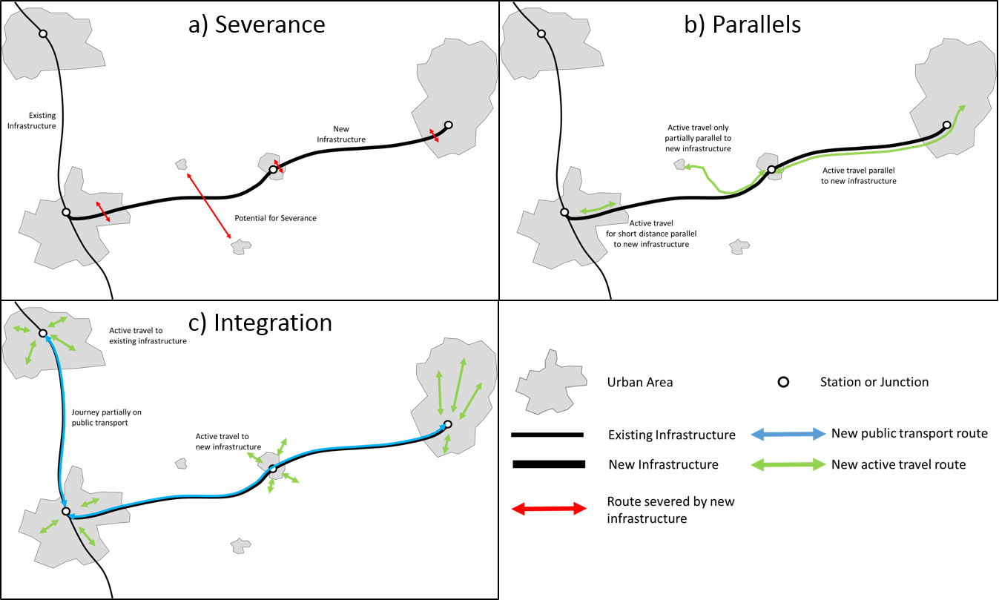
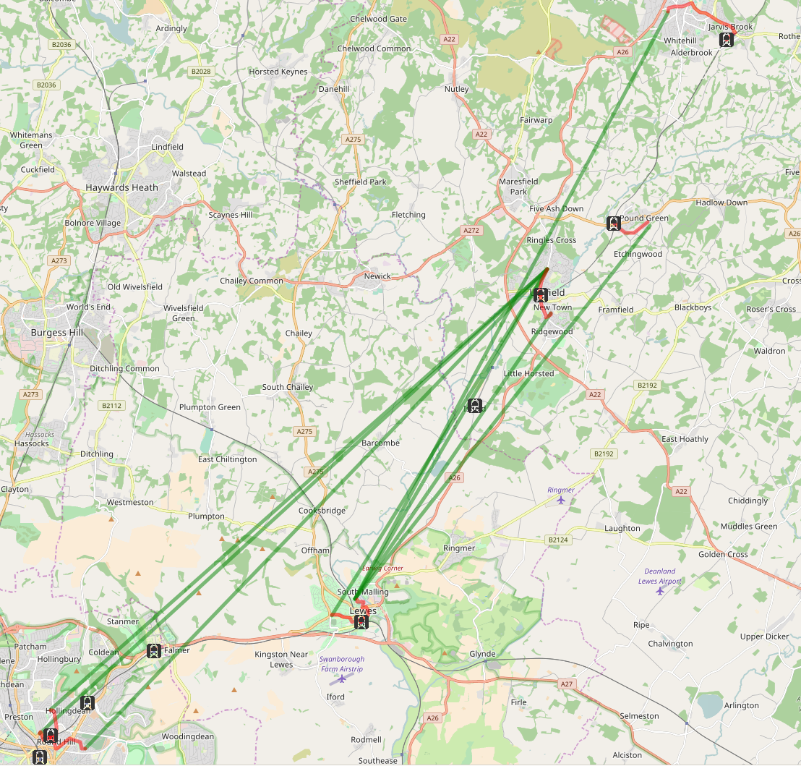

<!-- Warning: modify the .Rmd file not the .md file -->
Abstract
========

Major transport infrastructure projects affect many aspects of life.
This is well known and sometimes acted on, thanks in part to
well-established methods in economic appraisal, cost-benefit analysis
and environmental impact assessment. Recently other types of assessment
have emerged, including health and equality impact assessment.
<!-- [@harris-roxas_differing_2011]. --> There is an emerging literature
focussing explicitly on active travel impacts, much of which seeks to
evaluate the impacts of new schemes on walking.
<!-- [@mueller_health_2015]. --> However, there is little in the way of
methods for assessing likely impacts of new schemes *a-priori* in the
literature reviewed, let alone geographic methods for assessing
potential impacts based on potential levels of walking and cycling.

Motivated by the need for accessible and scalable tools to assess active
travel impacts of new developments, this paper sets out methods for
active travel impact assessment. It is based on the division of active
travel impacts based on the geographic relations between the development
and walking and cycling desire lines: *Severance*, when new
infrastructure cuts across routes with high active travel potential;
*parallels*, opportunities for constructing new routes parallel new
infrastructure; and *integration* with existing transport services,
where new or different active travel options are unlocked by new
infrastructure. A case study of a proposed railway, between Lewes and
Uckfield in Essex, UK, demonstrates the methods' real world application.

<!-- Cycling and Society abstract -->
<!-- background, methodology, results and impact of the research -->
<!-- Motivated by the need for accessible and scalable tools to assess active travel impacts of new developments, this paper sets out methods for active travel impact assessment. It is based on the division of active travel impacts based on the geographic relations between the development and walking and cycling desire lines: Severance, when new infrastructure cuts across routes with high active travel potential; parallels, opportunities for constructing new routes parallel new infrastructure; and integration with existing transport services, where new or different active travel options are unlocked by new infrastructure. A case study of a proposed railway, between Lewes and Uckfield in Essex, UK, demonstrates the methods’ real world application. -->
<!-- We find that the methods have the potential to identify and act on risks and opportunities associated with proposed developments down to road segment level. -->
<!-- We conclude that new methods, such as those presented in this paper, have the potential to ensure that the impacts of major infrastructure projects on walking and cycling are properly accounted for before building begins. -->
Introduction
============

Major transport infrastructure projects are a major beneficiary of
large-scale investment of public funding worldwide. Justifications
include economic growth (Preston 2013), reduction of geographical
inequalities (Liu, Dai, and Derudder 2016), modal shift (i.e. a switch
from private car or flying to rail) (Dobruszkes 2011), and improved
quality of life due to reduced time spent travelling (Fischer Jamie
Montague and Amekudzi Adjo 2011) although, in practice, psychological
and political factors (which tend to over-estimate benefits) are often
deciding factors (B. Flyvbjerg 2005; Cantarelli et al. 2012). In this
context there have been calls to make the decision-making process more
evidence-based (Hodge and Greve 2010), to account for environmental
(e.g. Akerman 2011) and health (e.g. Mueller et al. 2015) externalities.
Improving the assessment of the latter impact is the focus of this
paper.

<!-- Regardless of the diverse motivations for transport infrastructure investment, it is clear that they have and will continue to have major impacts.  -->
<!-- There is a substantial body of literature dedicated to the evaluation of the impacts of transport infrastructure, which can be considered a sub-discipline in the field of transport studies in its own right. -->
<!-- Despite the wide range of impacts incorporated in impact assessments, and the widening of assessments to incorporate social impacts [@jones_social_2012], active travel considerations are seldom taken into account, let alone analysed quantitatively. -->
Impact Assessment (IA) is an established part of the decision-making
process and active field of research which already provides a framework
within which active transport impacts can be accounted for. A potential
problem is that these impacts could be included in an increasingly wide
range of IA frameworks, including Environmental Impact Assessment (EIA),
Strategic Environmental Assessment (SEA), Health Impact Assessment
(HIA), Gender Impact Assessment (GIA) and Equality Impact Assessment
(EqIA) (Tajima and Fischer 2013). Within this gammut of activity the
methods in this paper clearly relate most closely to HIA, although in
practice active transport could be included in any one of those IAs.
EIA, for example, often includes a substantial health component and
health is enshrined in the European Union Directive 2014/52/EU in impact
assessment (*Directive 2014/52/EU of the European Parliament and of the
Council of 16 April 2014 Amending Directive 2011/92/EU on the Assessment
of the Effects of Certain Public and Private Projects on the Environment
Text with EEA Relevance* 2014).

Noting the increased prevalence of HIA in the overall IA process,
Harris-Roxas and Harris (2011) provide an overview of this emerging
field and propose a typology: mandated, decision-support, advocacy, and
community-initiated HIAs.

-   Increased life expectancy and physical well-being as a result of
    regular physical activity, estimated to have a major reduction of
    disability-adjusted life years lost due to non-communicable disease
    such as heart attacks (e.g. Götschi et al. 2015).
-   Reduced energy use and associated improvements in environmental
    outcomes through a modal shift away from the motor car (Lovelace et
    al. 2011).
-   Improved air quality through reduced dependence on motor vehicles
    accessing urban centres (Xia et al. 2015).
-   Improvements in transport equality, as people able to use pedal
    cycles (and electric and hand-cycles) but excluded from personal car
    use (e.g. by age, income or disability) become equally able to
    travel along active travel pathways as car drivers (Mullen et
    al. 2014).

<!-- Economic, health and environmental impacts are the focus (each of which link to active travel, as discussed in the subsequent paragraphs). In parallel to such research programs, there has been growing interest from transport researchers in the impacts of major infrastructure projects on transport patterns overall (going beyond the question of utilisation of the transport service provided by the specific piece of new infrastructure). -->
<!-- *Economic impact assessment* ... -->
<!-- *Environmental impact assessment* ... -->
Of existing impact assessment approaches, HIA and TIA have the most
obvious links to active travel. Even when these additional assessment
exercises are undertaken, or when they are amalgamated with the wider
process of Strategic Environmental Assessment (SEA) (Tajima and Fischer
2013), active travel impacts are rarely considered, let alone
quantified. This has been noted in the context of road building schemes:
"there is very little empirical data on the impact of road transport
interventions", aside from injury reduction estimates (Thomson et al.
2008).

Since then there has been an increase in the research attention focussed
on the wider impacts of road construction, inluding A notable research
project in this area is [Traffic and Health in
Glasgow](http://www.cedar.iph.cam.ac.uk/research/directory/traffic-health-glasgow/)
which analysed the impacts of an extension to the M74 motorway in 2011.
This project has has resulted in numerous findings, including evidence
of reduced levels of physical activity among participants who live in
close proximity to the motorway (R. G. Prins et al. 2017). Notably, the
project found evidence of increased car use in areas affected by the new
road, although no evidence of active travel impacts was identified (L.
Foley et al. 2017).

When active travel considerations are taken into account, it is often so
under sub-headings of health, air pollution, and other impacts, rather
than as a self-standing category of impact in its own right. Cohen,
Boniface, and Watkins (2014) are unusual in mentioning active travel
impacts of new transport infrastructure projects, but they do so under
the sub-categories of physical health, mental health, transport
inequalities and road safety. Active travel is mentioned in heading, but
only as a sub-sub-heading within road safety: "Active travel and
(mis)perceptions of danger". Joffe and Mindell (2002) provide a more
representative example of the HIA literature: it has no mention of
walking, cycling or active travel.

There is a clear need for methods and concepts to encourage active
travel impacts to be taken into account in the assessment of major
infrastructure projects. At the risk of further diluting the impact
assessment literature with more acronyms (see Tajima and Fischer 2013)
we refer to this aspect of impact assessment as Active Travel Impact
Assessment (ATIA), as a component of the wider process of HIA. Because
active travel is central to health, environmental and social impacts, we
suggest that ATIA
<!-- (or some alternative to it, perhaps building on the methods outlined in this paper or integrated into wider IA processes) -->
is a vital component of health impacts. Despite the importance of active
travel modes there are few tools for a-priori assessment and
quantification of large infrastructure projects on them, positive and
negative.

One tool that has been developed specifically to explore active
transport potential at regional to street levels (the geographic scope
of many large transport infrastructure projects) is the Propensity to
Cycle Tool (PCT) (Lovelace et al. 2017). The PCT is a publicly
accessible tool for exploring current cycling levels and the potential
to growth, under a range of national scenarios (see
[www.pct.bike](http://www.pct.bike/)). This prior work, and the fact
that the PCT is open source, suggests the underlying methods ---
geographic analysis of travel desire lines, routes and route networks
--- could also be used for ATIA, but using local rather than global
scenarios of change. Building on this context, the remainder of this
paper sets out methods for doing so and discusses the implications for
major transport infrastructure plans.

<!-- ## Why is active travel omitted from IA? - commented out for now as not directly relevant -->
<!-- Active transport lies at the opposite end of the spectrum of transport investment. Interventions that increase 'walkability' and 'cyclability' are usually (but not always or necessarily) smaller, cheaper and less disruptive than major infrastructure. They are often localised. They are often the responsibility of local transport authorities, whereas major infrastructure projects are almost always overseen by national transport departments or dedicated organisations reporting directly to central government. -->
<!-- This helps explain why the active travel impacts of major transport infrastructure projects are seldom considered, despite a number of obvious overlaps. -->
"Major transport projects may promote or discourage physical activity in
the form of walking and cycling", yet there has been very little
quantitative *a posteriori* evaluation of past projects (Ogilvie et al.
2006), let alone *a priori* assessment of potential impacts. The present
paper seeks to address this research and methodological gap, via
geographical methods and emphasis on cycling potential.

The lack of organisational overlap between major transport
infrastructure and active travel interventions helps explain why the two
are seldom considered. There has been very little research into the
active travel impacts of major infrastructure projects. Yet, as we shall
see in the next section, major transport infrastructure has the
potential to have a wide range of impacts on transport behaviour overall
and levels of active travel in particular. The purpose of this paper is
to create a framework for the consideration of active travel impacts of
major transport infrastructure. More importantly from a practitioner
perspective, it outlines and demonstrates methods for assessing these
impacts and prioritising interventions that will reduce the negative
impacts on walking and cycling.
<!-- The most radical option to minimise the active transport impacts of building large roads and railways is not to build them at all and invest in a series of smaller walking and cycling interventions instead. Arguments for doing this are discussed in the final section. -->

A typology of active transport impacts of major transport infrastructure projects
=================================================================================

Major infrastructure can impact upon active transport in a range of
different ways. To organise the assessment process, these can be
categorised into three broad types of impact, as illustrated in Figure
@ref(fig:type).

A typology of active travel options.

<!-- *Lable indervidual diagrams ... -->
Severance
---------

Linear infrastructure can become a barrier to travel perpendicular to
the new infrastructure, severing routes that were used before the new
infrastructure was built. This is especially true for railways and
motorways, which may be at a different level to the surrounding road
network, and are not crossable by walkers and cyclists without dedicated
crossings. Understanding where severance occurs and how many people are
affected can aid in effectively planning the construction of bridges,
tunnels, and other crossings.

Parallels
---------

New linear infrastructure provides an opportunity to construct new
footpaths and cycle paths alongside the infrastructure. The marginal
cost of adding active transport routes alongside other planned
infrastructure will often be lower than constructing a dedicated route
from scratch. Such new parallel footways and cycleways could encourage
people to entirely replace existing trips by non-active modes.
Furthermore parallels can encourage people to walk or cycle to the
nearest junction/station, boosting the potential for integration
(covered in the next section). The consideration of parallels encourages
HIAs to explore not only the project's potential to affect current
active transport trips but also the potential to generate new ones.

Integration of active travel and public transport
-------------------------------------------------

New infrastructure can result in an increase in active travel in nearby
areas along the route. For example, a railway extension may result in
more people walking or cycling in the centre of town to access the rail
network whereas they previously drove directly to their destination.
This effect can manifest at a substantial distance from the new
infrastructure, by linking previously disconnected areas.

Methodology
===========

A method for assessing each of the three types of active travel impact
is outlined in this section, such that it could be applied to any linear
feature of interest. Once set out, the method is then applied to a
specific example using a case study of the Lewes-Uckfield train line.
The methods have been implemented as functions in the R package
**stplanr** (Lovelace and Ellison 2016).

Potential cycling uptake along 'parallels'
------------------------------------------

To identify parallels to linear features (i.e. a new road or rail line),
a five stage methodology was developed.

-   Subset cycling desire lines[1] to include only those in which the
    *centre point of the line* passes close to the new infrastructure.
    This was set as 10 km buffer in this paper.
-   Break the linear infrastructure of interest into segments of even
    distance.
-   Calculate the angle of the segments and desire lines.
-   Subset the desire lines again, to include only those that are within
    a threshold angle (set at 30 degrees) of the mean bearing of their
    closest infrastructure segment.
-   Aggregate the cycling potential of all parallel lines within the
    threshold distance of each segment and assign the values to the
    route segments, based on methods set-out in (Lovelace et al. 2017).

Potential for severance
-----------------------

Severance occurs when active travel along cyclable desire lines with
high cycling potential is prevented or made more difficult by obstacles
such as rivers, fast roads or railway tracks. A degree of severance can
be expected along the full length of linear infrastructures. However,
the degree of severance will be greatest in certain *severance pinch
points* (henceforth referred to as severance points), for example,
segments along a rail track which intersects desire lines connecting
residential areas with employment zones on the other side.

The methodology used to identify the proposed route segments with
highest potential to cause severance (assuming the transport
infrastructure is new) consists of three stages:

-   Identify the desire lines which intersect with the infrastructure.
-   Quantify the number of potential cyclists blocked along segments of
    the infrastructure of every segment.
-   Subset the segments which block the highest number of potential
    cyclists and identify potential crossing points.

Note that based on the three-stage methodology outlined above, severance
points are in fact more precisely described as 'severance segments',
along which a range of points could be chosen for crossing points.
However, the term 'severance point' is more intuitive, so we use this
term throughout.

Potential for cycling and public transport integration
------------------------------------------------------

Increased travel to public transport is likely to occur near public
transport stops and on desire lines that have an origin and destination
near connected public transport nodes (typically bus stops or train
stations). The methodology used to estimate the potenial uptake of
cycling due to integration with new public transport services associated
with the new route assumes that new nodes have suitable provision for
cycling, with safe routes to get there and sufficient cycle parking
spaces, and consists of the following stages:

-   Subset trips that could feasibly use public transport in terms of
    boarding and alighting, by subsetting those with both origin and
    destination within a given distance a planned station/stop.
-   Remove lines that have the same stop as their closest origin and
    destination.
-   Remove lines which are linked by existing public transport, thus
    will not change with the new linear infrastructure.
-   Create new desire lines and routes that are from Origin/Destinations
    to public transport.
-   Remove desire lines and routes where the cycling to and from public
    transport is greater than 1.1 times the direct cycling route, as
    these travellers are unlikely to use public transport.
-   Calculate change in cycling potential along these new desire lines.

This method makes a number of simplifying assumptions that may or may
not be valid depending on the nature of the new linear infrastructure.
Firstly, the method is ignorant of the public transport network and so
assumes that travel between any pair of stops is possible and practical.
If this were not the case, it would be necessary to break the analysis
into connected parts and analyse each part of the networks separately.
Secondly, the method is not aware of financial and time costs associated
with public transport. While the method can identify routes that are
likely to be quicker to take a combined active travel and public
transport journey than merely active travel directly, it does not
consider the relative difference with driving directly. Therefore, care
should be taken when assigning cyclist to these new routes. Finally, the
method does not consider the proportion of walking and cycling to and
from the public transport stop. This is likely to be affected by a range
of variables such as distance and the ability to take a bike on public
transport.

A case study of Lewes-Uckfield
==============================

The Lewes-Uckfield train line is a proposed project to restore a rail
link between Uckfield and Lewes. This is part of wider plans to increase
rail capacity in the area. As stated in the project brief, "Such
infrastructure has the potential to support cycling if high-quality
infrastructure is built alongside." This appendix analyses cycling
potential along the proposed route, which is 16 km in length (see Figure
@ref(fig:lc)).
<!-- we'll need to provide more information on the case study - where exactly is it in terms of UK geography, length of new route, is it a terminal station etc. -->
Data on existing an potential future active travel patterns was taken
from the Propencity to Cycle Tool (Lovelace et al. 2017). The data
represents commuter travel between zones created for the 2011 census.
These zones are known as Middle layer Super Ouput Areas (MSOA), and the
population weighted centroids of each MSOA are used as the origin and
destinations in this analysis.

<!-- # Cycling potential surrounding the Lewes-Uckfield trainline -->
There are MSOAs whose population weighted centroids lie within a 10 km
buffer of the train line, representing commuters. This area is
illustrated in Figure @ref(fig:lc).

Overview of the Lewes-Uckfield line with a 10 km buffer (blue). Width is
proportional to the number of commutes; colour represents the proportion
of people who cycle.

The total number of single-stage commuters that pass through the buffer
is higher: commuters. As Figure @ref(fig:lc) illustrates, however, many
of these commuters are not travelling parallel to the train line. The
majority of desire lines intersecting the buffer are between Brighton
(see the high density of flows in the far south-west of Figure
@ref(fig:lc)) and its surrounding settlements. Only a few hundred
commuters pass directly parallel to the route, mostly of medium distance
from 10 to 20 km (route distance) between MSOAs in Lewes, Ringmer, and
Uckfield. This implies that cycle paths running parallel to the train
line itself have relatively low commuter cycling potential.

Cycling potential parallel to the route
---------------------------------------

### Subsetting desire lines by centre point proximity

The centre points of the desire lines intersecting with the
Lewes-Uckfield route buffer are presented in Figure
@ref(fig:metafigure)a. These represent % of the desire lines in the
study area, defined by the 10 km buffer.

The centre point-buffer (a), parallel (b), perpendicular (c) and station
access (d) methods of subsetting desire lines affected by the new rail
line. In all figures, the subsetted lines are plotted in red. In (b) the
updated parallel desire lines, whose centre points lie within 5 km of
the route, are illustrated in orange.

### Break the train line into segments

Because the Lewes-Uckfield line is short and relatively straight, we
used the entire line as a single segment. However, if the line were to
be broken into segments, the results would resemble Figure
@ref(fig:segs)a. This demonstration of the method could be applied to
larger and more complex routes, e.g. that of the proposed HS2 or HS2
cycle network route.

<!-- 

-->

Illustration of the method of splitting the route into discrete segments
using the line segment function from the stplanr R package (a) and
cycling potential (under the Government Target scenario) severed by the
proposed rail line (b), in which line width is proportional to the
square root of cycling potential severed.

### Calculate the angle of the train routes

The angle of the train track was calculated by a function
`line_bearing()` which was developed for the **stplanr** R package
specifically to solve this problem.

Using this function, the angle of the route was calculated as follows:

    line_bearing(lewes_uckfield)

    ## [1] 25.30456

### Subsetting desire lines parallel with the train line

To find the lines that were close to parallel with the train line, the
function `angle_diff()` was developed. All lines within 30 degrees,
clockwise or anti-clockwise, to the train line, *and* have their
midpoint within the route buffer, are illustrated in the red lines in
Figure @ref(fig:metafigure)b. It is clear from this Figure that a high
number of lines were selected which are very unlikely benefit from
cycling provision along the route, especially in the south-west segment
of the plot.

To resolve this issue, a smaller buffer was used to select line centre
points. This was set at 5 km. To remove desire lines that were still far
from the train line a further subsetting method was developed. This
involved selecting desire lines that pass within an even shorter
distance to the train line, 2 km in this case. The results are presented
in Figure Figure @ref(fig:metafigure)b, in which the orange lines were
included through the centre point selection method but omitted by
'buffer intersection' method.

From the subset of the lines highlighted in red in Figure
@ref(fig:metafigure)b, we can now report summary statistics on the
cycling potential of commuter desire lines which run parallel to the
Lewes-Uckfield route. These results are presented alongside the
equivalent statistics for *all* desire lines which intersect the 10 km
buffer surrounding the proposed route.

The potential for severance along the proposed route
----------------------------------------------------

### Subsetting 'perpendicular' desire lines

The subsetting process involved finding which lines ran perpendicular to
the proposed rail line and then selecting only those intersecting with
it, as illustrated in Figure @ref(fig:metafigure)c.

### Quantifying severance per segments of the train line

The cycling potential of the intersecting 'perpendicular' lines was then
summed *per 1 km segment* of the rail line. The results, for the
Government Target scenario, are presented in @ref(fig:segs)b which
shows, as one would expect, that severance impacts would be greatest at
the ends of the proposed route, where population densities and
employment opportunities are greatest.

### Identifying potential crossing points

From Figure @ref(fig:segs)b it is clear that the points of highest
potential severance lie at either end of the line. Overall, because the
proposed line does not separate any large settlements or workplaces, the
potential for severance is low. However, to demonstrate the method of
identifying places to intervene to minimise severance, Figure
@ref(fig:perpmost) illustrates the 1 km segment of the proposed line
with the highest potential for severance in context. This is clearly in
a populated part of Lewes, where travel between both sides of the new
line could be affected by the route.

The 1 km segment on the proposed rail line with the highest level of
severance in cycling potential, under the Government Target scenario.

Cycling to Public Transport
---------------------------

Beyond direct impacts of the proposed scheme on cycling potential,
associated with desire lines in parallel with and crossing perpendicular
to the railway, there are indirect impacts created by the potential to
cycle to the stations(Flamm and Rivasplata 2014) . Because the proposed
rail stations are located in areas of high population density, this
could generate new cycle trips when they are taken as part of a
multi-stage trip (e.g. cycle to the rail station, catch the train
towards work, walk from the 'activity end' rail station to work).

Analysis of the OD data in relation to proposed rail station locations
suggests that relatively few desire lines, representing 2351 commuters,
currently commute between areas served by the new rail stations, within
a 3 km buffer (see @ref(fig:metafigure)d). The main beneficiaries in the
local area would be people north of Uckfield commuting to Lewes and vice
versa. Desire lines between Lewes and Brighton can use the existing
railway, while there are no desire lines between Brighton and North of
Uckfield. The lack of desire lines likely reflects the current transport
network's lack of connectivity between Lewes and Uckfield.  
Changes in travel patterns caused by new rail links are beyond the scope
of this paper. However, the method outlined above could be combined with
existing techniques to understand the mode shift to rail, and thus
predict any cycling increase resulting from a change in rail
connectivity.

Results
-------

Based on the methods presented in the previous sections summary
statistics for each of the desire line subsets, based on parallels and
severed routes, can be compared with all desire lines in the study area.
These are presented in the tables below. Table 1 contains summary
statistics on the total number, car dominance and level and cycling for
each subset. Table 2 contains scenario-specific estimates of cycling
potential for each of the desire line subsets.

<table>
<caption>Current and potential future cycle commuters who may be affected by the proposed rail line, under baseline and future scenarios (based on the 2011 Census and a doubline in cycling potential) for the three types of affected desire lines plus all desire lines in the vecinity (touching the 10 km buffer) surrounding the proposed route.</caption>
<thead>
<tr class="header">
<th align="left">Scenario</th>
<th align="left">N. commuters</th>
<th align="left">N. cycling</th>
<th align="left">% cycling</th>
<th align="left">Distance (km, Euclidean)</th>
</tr>
</thead>
<tbody>
<tr class="odd">
<td align="left">Baseline</td>
<td align="left"></td>
<td align="left"></td>
<td align="left"></td>
<td align="left"></td>
</tr>
<tr class="even">
<td align="left">1</td>
<td align="left">56610</td>
<td align="left">1611</td>
<td align="left">2.8</td>
<td align="left">12.7</td>
</tr>
<tr class="odd">
<td align="left">2</td>
<td align="left">2021</td>
<td align="left">20</td>
<td align="left">1</td>
<td align="left">14.5</td>
</tr>
<tr class="even">
<td align="left">3</td>
<td align="left">2620</td>
<td align="left">47</td>
<td align="left">1.8</td>
<td align="left">15</td>
</tr>
<tr class="odd">
<td align="left">Cycling to stations</td>
<td align="left">574</td>
<td align="left">3</td>
<td align="left">0.5</td>
<td align="left">17.9</td>
</tr>
<tr class="even">
<td align="left">Scenario</td>
<td align="left"></td>
<td align="left"></td>
<td align="left"></td>
<td align="left"></td>
</tr>
<tr class="odd">
<td align="left">1</td>
<td align="left">56610</td>
<td align="left">2676</td>
<td align="left">4.7</td>
<td align="left">12.7</td>
</tr>
<tr class="even">
<td align="left">2</td>
<td align="left">2021</td>
<td align="left">46</td>
<td align="left">2.3</td>
<td align="left">14.5</td>
</tr>
<tr class="odd">
<td align="left">3</td>
<td align="left">2620</td>
<td align="left">98</td>
<td align="left">3.7</td>
<td align="left">15</td>
</tr>
<tr class="even">
<td align="left">Cycling to stations</td>
<td align="left">574</td>
<td align="left">49.5</td>
<td align="left">8.6</td>
<td align="left">2.6</td>
</tr>
</tbody>
</table>

Overall the potential for cycling along routes parallel to the track
appears to be somewhat greater than the cycling potential of 'severed'
routes.

Cycling potential around the proposed route
-------------------------------------------

Under the ambitious Ebike scenario, the PCT shows that cycling potential
along routes running parallel to the line is uneven geographically.
Unsurprisingly, cycling potential is clustered at either end of the
proposed route, with relatively high increases modelled along segments
of the network between Lewes and Ringmer, along the A26 and along routes
running north-south through Uckfield. This is shown in Figure
@ref(fig:pct-uck).

Cycling potential (red lines) along the transport network between Lewes
and Uckfield, under the Ebike scenario of the Propensity to Cycle Tool
(see [pct.bike/east-sussex/](http://pct.bike/east-sussex/)).

Potential for integation with public transport network
------------------------------------------------------

The method we used to estimate the potential uptake in active travel
resulting from walking and cycling to and from public transport stops
was undertaken in three stages:

first stage in estimating the cycling people who may use active travel
to reach a station is to identify those who wish to travel between two
stations. This is done by selecting desire lines, which have both origin
and destination within 3km of a station. From this subset of desire
lines, any which have the same station as the closest to both origin and
destination are excluded. Finally, lines between stations that are
already connected by the existing rail network are removed, as these
routes will not be changed by the new Lewes-Uckfield Line, thus travel
patterns in these areas are likely to remain the same.

Having identified the desire lines and their corresponding stations, it
is possible to calculate routes from each origin/destination to the
nearest station. In this case, the cyclestreets.net routing algorithm
was used. The results of the sub-setting and routing are show in
@ref(fig:segs)d, eight desire lines were identified (green) representing
574 commuters. Their associated active travel routes are shown in red.
Calculating the increase in active travellers along these routes would
be dependent on the number of commuters switching to the new railway
after it was constructed. However, even without a precise quantification
the mode shift, the method highlights which areas may have increased
active travel. It is notable that in @ref(fig:segs)d not every station
has an associated active travel route, this is because the new railway
would not affect travel options evenly.

The potential for active travel to stations on the route network (red
lines) and \[

Discussion
==========

In terms of the local case study, it seems there is greater potential
parallel to the proposed route than perpendicular to it, indicating the
risks of community severance for cycling uptake are likely to be lower
than the potential for cycling uptake along lines parallel to the route.

In total, we estimate that around 2500 commuters make trips that are
parallel to the line, of whom 1.1% currently cycle (N=28). We further
estimate that under a Go Dutch scenario the proportion of these commuter
cycling would be 6.1% (N=158), while under the Ebike scenario it would
be 15.4% (N=397). The Go Dutch and Ebike scenarios assume that English
commuters acquire a Dutch cycling culture and Dutch levels of
infrastructure: a high quality, traffic-free cycle route along the
Lewes-Uckfield train line could be a useful step towards achieving Dutch
infrastructure, although it should be remembered that the impact of the
cycle path might also depend on the quality of the surrounding cycle
network. It should also be remembered that this analysis only examines
commuter cycling; adding in cycling potential for other cycling types,
e.g. leisure cycling, might generate considerably higher estimates as to
the number of users.

The proposed method raises questions about policy priorities related to
mode choice: in cases where there is potential for improving of walking,
cycling and public transport, which are favoured?

The methods outlined in this paper have the potential to be used in
situations beyond the assessment of new infrastructure. For example, in
places where there are linear features that are conducive to conversion
into walking and cycling paths such as disused railway lines, roads,or
along privately owned routes. The methods outlines above could be used
to decide along which parts of these features investments should be
prioritised.

It is in terms of the methods for quantifying the potential for desire
lines parallel and perpendicular to proposed routes that this report
will probably be of most use, as the basis for further work. The
Lewes-Uckfield line has served a useful purpose in this regard, as the
case study is small enough to identify specific desire lines of interest
and explore the methodology on local datasets that are not
overwhelmingly large. The work provides many interesting avenues for
further development and research, including:

-   The estimation of angles on a *per segment* basis, rather than
    simply for the whole route.
-   Improvements to the input data, including additional trip purposes
    (the analysis only considers cycle commuting), increased
    geographical resolution (e.g. to the Lower Super Output Area level
    used in recent versions of the PCT), and analysis of a range of
    proposed route options rather than just one.
-   The automation of the analysis of 'parallels' and 'severance points'
    by creating functions which take desire lines and a proposed route
    as inputs and output the results with a single command. This could
    potentially be implemented in the R package **stplanr**.
-   The extension of the method to quantify the level of overlap between
    proposed cycle networks and a series of desire lines or a route
    network.

A limitation of the current approach from a policy perspective is that
the estimated impacts are presented as absolute values. Although this
could be justified from methodological and public engagement
perspectives --- in terms of ease of generating and understanding the
results --- there is a danger that the perceived objectivity of the
approach could reduce opportunities for legitimate debate. As with any
a-priori impact evaluation process, modelling undertaken by experts
could be used *intead of* a rigorous public consultation, taking into
account the views of the affected population. To take hypothetical
example, if the method were used to justify a major project, which
ended-up having negative overall impacts, it could do more harm than
good. Of course this hypothetical example is unlikely to arise in
practice as ATIA is currently non-existant. However, it is useful as it
leads to recommendations about how the methods should be used: that
sensitivity analysis (not conducted in this paper) should be undertaken
to demonstrate the range of potential impacts; that the results should
feed-into wider processes of impact assessment; and that the method
should be transparent. This final recommendation resonates with the
wider project from which these methods arose: the PCT is an explicitly
open source and publicly accessible tool (Lovelace et al. 2017). As
such, impact assessment work or software resulting from the methods
presented here should also be open source and open access, e.g. via an
interactive on-line web tool and publication of the 'source code'
underlying the work and resulting datasets.

Acknowledgements
================

Thanks to Matthew Whittle who digitised a scanned image of the proposed
route.

References
==========

Akerman, Jonas. 2011. “The Role of High-Speed Rail in Mitigating Climate
Change – the Swedish Case Europabanan from a Life Cycle Perspective.”
*Transportation Research Part D: Transport and Environment* 16 (3):
208–17.
doi:[10.1016/j.trd.2010.12.004](https://doi.org/10.1016/j.trd.2010.12.004).

Cantarelli, C. C., E. J. E. Molin, B. van Wee, and B. Flyvbjerg. 2012.
“Characteristics of Cost Overruns for Dutch Transport Infrastructure
Projects and the Importance of the Decision to Build and Project
Phases.” *Transport Policy* 22 (July): 49–56.
doi:[10.1016/j.tranpol.2012.04.001](https://doi.org/10.1016/j.tranpol.2012.04.001).

Cohen, Judith M., Sadie Boniface, and Stephen Watkins. 2014. “Health
Implications of Transport Planning, Development and Operations.”
*Journal of Transport & Health* 1 (1): 63–72.
doi:[10.1016/j.jth.2013.12.004](https://doi.org/10.1016/j.jth.2013.12.004).

*Directive 2014/52/EU of the European Parliament and of the Council of
16 April 2014 Amending Directive 2011/92/EU on the Assessment of the
Effects of Certain Public and Private Projects on the Environment Text
with EEA Relevance*. 2014. *124*. Vol. OJ L.
<http://data.europa.eu/eli/dir/2014/52/oj/eng>.

Dobruszkes, Fr’ed’eric. 2011. “High-Speed Rail and Air Transport
Competition in Western Europe: A Supply-Oriented Perspective.”
*Transport Policy* 18 (6): 870–79.
doi:[10.1016/j.tranpol.2011.06.002](https://doi.org/10.1016/j.tranpol.2011.06.002).

Fischer Jamie Montague, and Amekudzi Adjo. 2011. “Quality of Life,
Sustainable Civil Infrastructure, and Sustainable Development:
Strategically Expanding Choice.” *Journal of Urban Planning and
Development* 137 (1): 39–48.
doi:[10.1061/(ASCE)UP.1943-5444.0000039](https://doi.org/10.1061/(ASCE)UP.1943-5444.0000039).

Flamm, Bradley J., and Charles R. Rivasplata. 2014. “Public Transit
Catchment Areas the Curious Case of Cycle-Transit Users.”
*Transportation Research Record*, no. 2419: 101–8.
doi:[10.3141/2419-10](https://doi.org/10.3141/2419-10).

Flyvbjerg, Bent. 2005. *Policy and Planning for Large Infrastructure
Projects: Problems, Causes, Cures*. World Bank Publications.

Foley, Louise, Richard Prins, Fiona Crawford, Shannon Sahlqvist, David
Ogilvie, and M74 study team. 2017. “Effects of Living Near a New Urban
Motorway on the Travel Behaviour of Local Residents in Deprived Areas:
Evidence from a Natural Experimental Study.” *Health & Place* 43
(January): 57–65.
doi:[10.1016/j.healthplace.2016.11.008](https://doi.org/10.1016/j.healthplace.2016.11.008).

Götschi, Thomas, Marko Tainio, Neil Maizlish, Tim Schwanen, Anna
Goodman, and James Woodcock. 2015. “Contrasts in Active Transport
Behaviour Across Four Countries: How Do They Translate into Public
Health Benefits?” *Preventive Medicine* 74 (May): 42–48.
doi:[10.1016/j.ypmed.2015.02.009](https://doi.org/10.1016/j.ypmed.2015.02.009).

Harris-Roxas, Ben, and Elizabeth Harris. 2011. “Differing Forms,
Differing Purposes: A Typology of Health Impact Assessment.”
*Environmental Impact Assessment Review*, Health impact assessment in
the asia pacific, 31 (4): 396–403.
doi:[10.1016/j.eiar.2010.03.003](https://doi.org/10.1016/j.eiar.2010.03.003).

Hodge, Graeme, and Carsten Greve. 2010. “Public-Private Partnerships:
Governance Scheme or Language Game?” *Australian Journal of Public
Administration* 69 (s1): S8–S22.
doi:[10.1111/j.1467-8500.2009.00659.x](https://doi.org/10.1111/j.1467-8500.2009.00659.x).

Joffe, M., and J. Mindell. 2002. “A Framework for the Evidence Base to
Support Health Impact Assessment.” *Journal of Epidemiology and
Community Health* 56 (2): 132–38.
doi:[10.1136/jech.56.2.132](https://doi.org/10.1136/jech.56.2.132).

Liu, Xingjian, Liang Dai, and Ben Derudder. 2016. “Spatial Inequality in
the Southeast Asian Intercity Transport Network.” *Geographical Review*,
April, n/a–n/a.
doi:[10.1111/j.1931-0846.2016.12181.x](https://doi.org/10.1111/j.1931-0846.2016.12181.x).

Lovelace, Robin, and Richard Ellison. 2016. *Stplanr: Sustainable
Transport Planning*. <https://github.com/ropensci/stplanr>.

Lovelace, Robin, S.B.M. B M Beck, M. Watson, and A. Wild. 2011.
“Assessing the Energy Implications of Replacing Car Trips with Bicycle
Trips in Sheffield, UK.” *Energy Policy* 39 (4): 2075–87.
doi:[10.1016/j.enpol.2011.01.051](https://doi.org/10.1016/j.enpol.2011.01.051).

Lovelace, Robin, Anna Goodman, Rachel Aldred, Nikolai Berkoff, Ali
Abbas, and James Woodcock. 2017. “The Propensity to Cycle Tool: An Open
Source Online System for Sustainable Transport Planning.” *Journal of
Transport and Land Use* 10 (1).
doi:[10.5198/jtlu.2016.862](https://doi.org/10.5198/jtlu.2016.862).

Mueller, Natalie, David Rojas-Rueda, Tom Cole-Hunter, Audrey de Nazelle,
Evi Dons, Regine Gerike, Thomas Götschi, Luc Int Panis, Sonja Kahlmeier,
and Mark Nieuwenhuijsen. 2015. “Health Impact Assessment of Active
Transportation: A Systematic Review.” *Preventive Medicine* 76 (July):
103–14.
doi:[10.1016/j.ypmed.2015.04.010](https://doi.org/10.1016/j.ypmed.2015.04.010).

Mullen, Caroline, Miles Tight, Anthony Whiteing, and Ann Jopson. 2014.
“Knowing Their Place on the Roads: What Would Equality Mean for Walking
and Cycling?” *Transportation Research Part A: Policy and Practice* 61
(March): 238–48.
doi:[10.1016/j.tra.2014.01.009](https://doi.org/10.1016/j.tra.2014.01.009).

Ogilvie, David, Richard Mitchell, Nanette Mutrie, Mark Petticrew, and
Stephen Platt. 2006. “Evaluating Health Effects of Transport
Interventions: Methodologic Case Study.” *American Journal of Preventive
Medicine* 31 (2): 118–26.
doi:[10.1016/j.amepre.2006.03.030](https://doi.org/10.1016/j.amepre.2006.03.030).

Preston, John. 2013. “The Economics of Investment in High-Speed Rail.”
*OECD*.

Prins, R. G., L. Foley, N. Mutrie, D. B. Ogilvie, and M74 study team.
2017. “Effects of Urban Motorways on Physical Activity and Sedentary
Behaviour in Local Residents: A Natural Experimental Study.” *The
International Journal of Behavioral Nutrition and Physical Activity* 14
(1): 102.
doi:[10.1186/s12966-017-0557-0](https://doi.org/10.1186/s12966-017-0557-0).

Tajima, Ryo, and Thomas B Fischer. 2013. “Should Different Impact
Assessment Instruments Be Integrated? Evidence from English Spatial
Planning.” *Environmental Impact Assessment Review* 41: 29–37.

Thomson, Hilary, Ruth Jepson, Fintan Hurley, and Margaret Douglas. 2008.
“Assessing the Unintended Health Impacts of Road Transport Policies and
Interventions: Translating Research Evidence for Use in Policy and
Practice.” *BMC Public Health* 8: 339.
doi:[10.1186/1471-2458-8-339](https://doi.org/10.1186/1471-2458-8-339).

Xia, Ting, Monika Nitschke, Ying Zhang, Pushan Shah, Shona Crabb, and
Alana Hansen. 2015. “Traffic-Related Air Pollution and Health
Co-Benefits of Alternative Transport in Adelaide, South Australia.”
*Environment International* 74 (January): 281–90.
doi:[10.1016/j.envint.2014.10.004](https://doi.org/10.1016/j.envint.2014.10.004).

[1] A 'desire line' refers to a straight line connecting an
origin-destination pair. In the context of this paper, which uses the
outputs of the PCT version 1 as its input dataset, this means straight
lines with a distance of 20 km or less connecting Middle Super Output
Area population weighted centroids, with data on the number of people
commuting in both directions. See Lovelace et al. (2017) for further
details.
